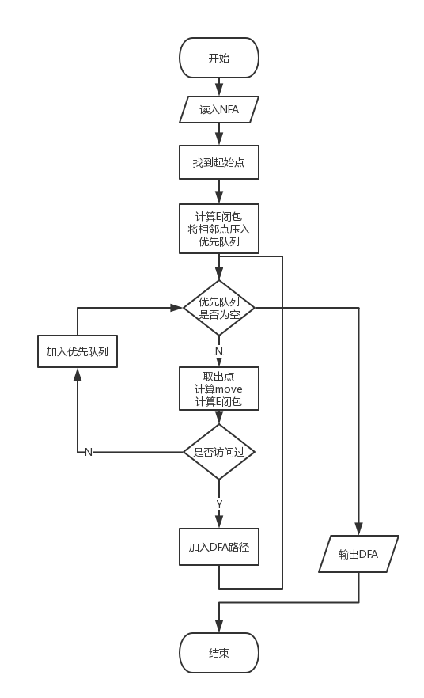
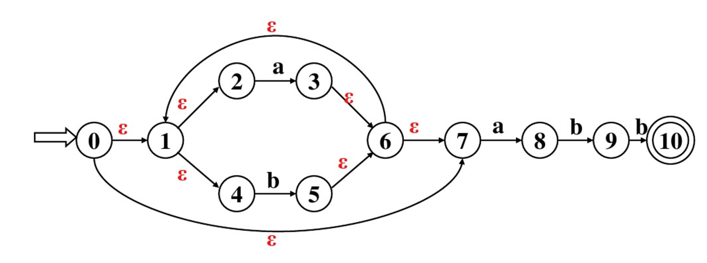
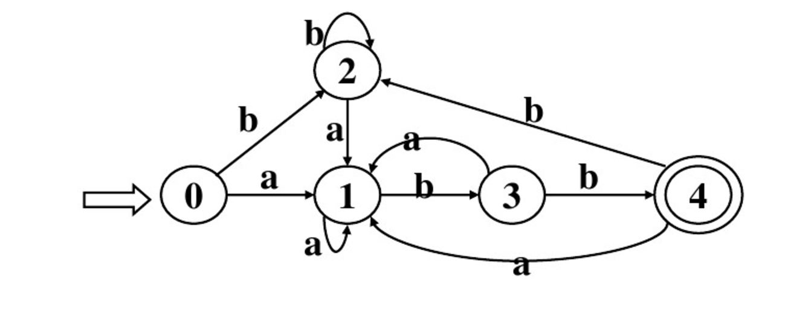

# 编译原理实验报告 - 有限自动机的确定化和最小化
> 14051435 叶梅北宁

## 实验目的

1. 理解有限自动机的作用，进一步理解有限自动机理论
2. 设计有限自动机的表示方式，采用合理的数据结构表示自动机的五个组成部分
3. 以程序实现有限自动机确定化和最小化算法，提高算法的理解和实现能力


## 实验步骤

本实验采用Python完成，NFA，DFA使用json保存在文件中



文件结构：

```
k	状态集
e	字母表
f	转换函数
s	初态
z	终态
{
  "k": ["0", "1", "2", "3", "4", "5", "6", "7", "8", "9", "10"],
  "e": ["a", "b"],
  "f": {
    "0": {
      "#": ["1", "7"]
    },
    "1": {
      "#": ["2", "4"]
    },
    "2": {
      "a": ["3"]
    },
    "3": {
      "#": ["6"]
    },
    "4": {
      "b": ["5"]
    },
    "5": {
      "#": ["6"]
    },
    "6": {
      "#": ["1", "7"]
    },
    "7": {
      "a": ["8"]
    },
    "8": {
      "b": ["9"]
    },
    "9": {
      "b": ["10"]
    }
  },
  "s": ["0"],
  "z": ["10"]
}
```

## 实验中遇到的问题

这次实验比较简单，很快就完成了实验，没有遇到什么大问题。

但是，在一开始写完代码之后。发现一个很小的NFA转化需要很长时间，程序效率很差。

之后为E闭包的计算和Move操作计算增加了缓存操作，也就是每个点的处理都缓存在内存中。之后效率大大提高。

## 测试分析

程序中使用的NFA图:



构建的json代码:

```
{
  "k": ["0", "1", "2", "3", "4", "5", "6", "7", "8", "9", "10"],
  "e": ["a", "b"],
  "f": {
    "0": {
      "#": ["1", "7"]
    },
    "1": {
      "#": ["2", "4"]
    },
    "2": {
      "a": ["3"]
    },
    "3": {
      "#": ["6"]
    },
    "4": {
      "b": ["5"]
    },
    "5": {
      "#": ["6"]
    },
    "6": {
      "#": ["1", "7"]
    },
    "7": {
      "a": ["8"]
    },
    "8": {
      "b": ["9"]
    },
    "9": {
      "b": ["10"]
    }
  },
  "s": ["0"],
  "z": ["10"]
}
```

转化后的DFA代码:

```
{
    "e": [
        "a", 
        "b"
    ], 
    "f": {
        "0": {
            "a": "1", 
            "b": "2"
        }, 
        "1": {
            "a": "1", 
            "b": "3"
        }, 
        "2": {
            "a": "1", 
            "b": "2"
        }, 
        "3": {
            "a": "1", 
            "b": "4"
        }, 
        "4": {
            "a": "1", 
            "b": "2"
        }
    }, 
    "k": [
        "0", 
        "1", 
        "2", 
        "3", 
        "4"
    ], 
    "s": [
        "0"
    ], 
    "z": [
        "4"
    ]
}
```

对应的DFA图



测试:

```
➜  src git:(master) ✗ python convert.py -i ../nfa1.json -o ../dfa1.json -t ../test/test.txt
[aabb] passed
[aaaaaaaabbbbbbbbabb] passed
[oqoeiqd] failed
[sdiq2p313] failed
[1231323023] failed
```

## 实验总结

自己写过一遍代码之后，对子集构造法的理解更深了一步。
同时加强了对代码结构优化的能力，提高了程序的运行效率。