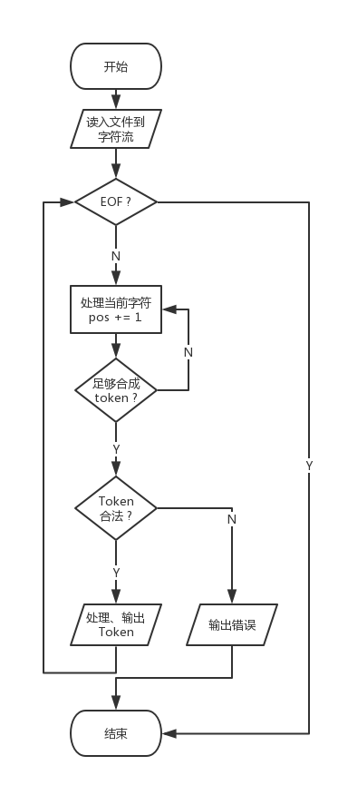

# 编译原理实验报告 - 词法分析
> 14051435 叶梅北宁

## 实验目的

设计、编制并调试一个词法分析程序，加深对词法分析原理的理解。

## 实验步骤



## 实验中遇到的问题

### Token之间的分隔符

一开始直接采用空格分割Token，后来发现遇到/t, /n之类的符号处理时会出错。

***解决策略***: 修改代码，只处理正确或是错误的字符，遇到其他的空格，/t, /n之类的分隔符直接跳过

### 9x 8ab之类的Token如何处理

早期的程序中并没有处理错误的Token，原本打算放在语法分析器中处理，之后修改了Token的识别方法。直接完成处理。

## 测试分析

测试代码1:

```
begin 
    x:=9x; 
    if x>9 then x:=2*x+1/3; 
end
while (i <> 1) 
    begin 
        x:=i-1; i:=1; 
    end
do 
    i:= i + 1 
while (i < 3)
#
```

测试结果:

```
➜  Lexical git:(master) ✗ ./build/lexical ./test/test.txt
( 1, begin)
(10, x)
(17, :=)
(11, 9)
(26, ;)
( 2, if)
(10, x)
(23, >)
Unexpected token 57, in line 2
```
第二行的9x出现错误，修改之后：

```
➜  Lexical git:(master) ✗ ./build/lexical ./test/test.txt
( 1, begin)
(10, x)
(17, :=)
(11, 9)
(26, ;)
( 2, if)
(10, x)
(23, >)
(11, 9)
( 3, then)
(10, x)
(17, :=)
(11, 2)
(14, *)
(10, x)
(12, +)
(11, 1)
(15, /)
(11, 3)
(26, ;)
( 6, end)
( 4, while)
(27, ()
(10, i)
(21, <>)
(11, 1)
(28, ))
( 1, begin)
(10, x)
(17, :=)
(10, i)
(13, -)
(11, 1)
(26, ;)
(10, i)
(17, :=)
(11, 1)
(26, ;)
( 6, end)
( 5, do)
(10, i)
(17, :=)
(10, i)
(12, +)
(11, 1)
( 4, while)
(27, ()
(10, i)
(20, <)
(11, 3)
(28, ))
( 0, #)
```
通过测试

## 总结体会

最大的体会在于不同Token之间的分析与处理，显然，9x这种是一个错误的token，而不是两个正确的token。

虽然许多编译器把9 和 x分成了2个不同token，在之后的语法分析器中处理。但是，在词法分析器中做完处理更恰当一些。