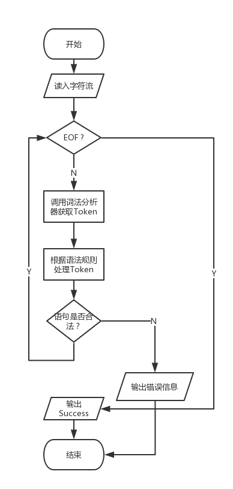

# 编译原理实验报告 - 语法分析
> 14051435 叶梅北宁

## 实验目的
编写一个语法分析程序，实现对词法分析程序所提供的单词序列的语法检查和结构分析。

## 实验步骤

采用LL(1) 分析法



## 实验中遇到的问题

### 逻辑问题

一开始的时候，把begin end 和 ()放在一起处理，发现程序无法成功运行，调试了许久。

最后重新看了一下书本，把begin end放在statement()中处理，之后在递归处理其他语句。

### 运算符优先级问题

“+” ， “-” 之后的表达式有时候是可以拆分的。

而 “*”， “／” 之后只能存在因子

而且在运算符中，“*” “／”的优先级高于“+” “-”。

再为每个token添加优先级之后问题解决。

## 测试分析

测试样例1:

```
begin a := 9; x := 2 * 3; b := a + x; end#
``` 

结果:

```
➜  Syntactic git:(master) ✗ ./build/Syntactic test/test1.txt
success!
```

测试样例2:

```
end x:= a + b * c; end#
```

结果:

```
➜  Syntactic git:(master) ✗ ./build/Syntactic test/test2.txt
Error!, line 1: expected token: end
```

## 总结体会

LL(1)语法分析相对LR来说较为简单。自顶向下分析，需要判断的情况相对也较少。

实验过程中没有遇到比较大的问题，只是在一开始尝试的时候。遇到递归下降时没有很明确的思路，构造语法规则耗费了比较多的时间。