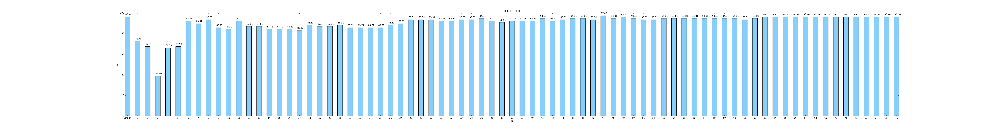

# 数据挖掘作业03

## SVM分类器的使用与数据特征提取

* 14051435 叶梅北宁
* 14051440 周贤杰
* 14051409 陈品维

### 实验分析

本次试验使用的数据为老师提供的dlbcl数据。

共77组，2类，每组数据6285维。

实验使用opencv的SVM分类器作为实验分类器，opencv的PCA算法用来对数据进行特征提取，同时使用opencv提供的python接口进行代码编写。

#### 实验要点

本次实验考查的要点并不在分类器的使用上，因为老师提供的数据维数过高。虽然只有77组，但是随着组数增加，分类器的训练代价会迅速增加。

> 如何合适地对数据进行降维

目前碰到的就是一个典型的p >> n的问题，参考论文

***Meier L, Van De Geer S, Bühlmann P. The group lasso for logistic regression[J]. Journal of the Royal Statistical Society, 2008, 70(1):53-71.***

比较高效的解决方法可以使sparse regularization，让矩阵变得稀疏从而完成特征选择。或者使用论文中的BCGD算法，常用在处理DNA数据中。

但是，实验中又发现老师提供的数据组数非常少，只有77组。一般在数据量很小的时候，使用PCA算法将为也许会有意想不到的结果。

最终选定使用PCA算法作为特征筛选算法。

> 在降维果过程中如何选择合适的维数

opencv提供的PCA算法中，在维数 > 数据组数的时候，默认将维数降低到数据组数。

实验中，我们自己写过PCA将维算法，通过计算每个成分的贡献率。通过筛选出较大贡献率的数据使得总贡献率达到一个合适的数值，之后确定将维的N值。

但是，因为自己手写的PCA算法在计算协方差的时候效率过低，最终还是决定使用opencv提供的PCA算法。

#### 实验环境

***实验使用opencv3.1.0 Release版本，于MacOS 10.12.1 Serria下自行编译***

* CPU: 2.2 GHz Intel Core i7
* 内存: 16 GB 1600 MHz DDR3
* Opencv 版本: 3.1.0 Release
* Python 版本: 3.5.2
* Numpy 版本: 1.11.2
* Matplotlib 版本: 1.5.3

### 实验过程

项目GitHub地址: [Data Mining](https://github.com/LostMoonkin/HomeWork/tree/master/DataMining/HomeWork_3_SVM)


首先先对数据进行归一化，对所有数据取自然对数。`x = log(x)`

运行代码后，会枚举1 - N(N为数据组数)的维度，测试降维算法。最后生成对应图表。

***在不对数据进行降维时，loocv的测试准确率为96.10%***

代码1: 自己实现的PCA降维

```
# def get_pac_mat(datas, percentage=0.99):
#
#     def zero_mean(data_mat):
#         mean_val = np.mean(data_mat, axis=0)
#         new_data = data_mat - mean_val
#         return new_data, mean_val
#
#     def percentage2n(eig_vals, percentage):
#         sort_array = np.sort(eig_vals)
#         sort_array = sort_array[-1::-1]
#         array_sum = sum(sort_array)
#         tmp_sum = 0
#         num = 0
#         for i in sort_array:
#             tmp_sum += i
#             num += 1
#             if tmp_sum >= array_sum * percentage:
#                 return num
#
#     data_mat, mean_val = zero_mean(np.mat(datas))
#     cov_mat = np.cov(data_mat, rowvar=0)
#     eig_vals, eig_vects = np.linalg.eig(np.mat(cov_mat))
#     n = percentage2n(eig_vals, percentage)
#     eig_val_indice = np.argsort(eig_vals)
#     n_eig_val_indice = eig_val_indice[-1:-(n + 1):-1]
#     n_eigVect = eig_vects[:, n_eig_val_indice]
#     lowDDataMat = data_mat * n_eigVect
#     reconMat = (lowDDataMat * n_eigVect.T) + mean_val
#     return lowDDataMat, reconMat
```

代码2: 使用opencv提供的PCA降维函数

```
mean, eigenvectors = cv2.PCACompute(new_data, np.mean(new_data, axis=0).reshape(1, -1), cv2.PCA_DATA_AS_ROW, maxComponents=n)
	
train_data = cv2.PCAProject(new_data, mean, eigenvectors)
```

### 实验结果

代码运行方法:

```
python3 svm.py -l {label file} -d {data file} 
```

```
python3 svm.py -l ./data/label.txt -d ./data/data.txt
0 completed. 0.961038961038961
1 completed. 0.7272727272727273
2 completed. 0.6753246753246753
3 completed. 0.38961038961038963
4 completed. 0.6623376623376623
5 completed. 0.6753246753246753
6 completed. 0.922077922077922
7 completed. 0.8961038961038961
8 completed. 0.935064935064935
9 completed. 0.8571428571428571
10 completed. 0.8441558441558441
11 completed. 0.922077922077922
12 completed. 0.8701298701298701
13 completed. 0.8701298701298701
14 completed. 0.8441558441558441
15 completed. 0.8441558441558441
16 completed. 0.8441558441558441
17 completed. 0.8311688311688312
18 completed. 0.8831168831168831
19 completed. 0.8701298701298701
20 completed. 0.8701298701298701
21 completed. 0.8831168831168831
22 completed. 0.8571428571428571
23 completed. 0.8571428571428571
24 completed. 0.8571428571428571
25 completed. 0.8571428571428571
26 completed. 0.8831168831168831
27 completed. 0.8961038961038961
28 completed. 0.935064935064935
29 completed. 0.935064935064935
30 completed. 0.935064935064935
31 completed. 0.922077922077922
32 completed. 0.922077922077922
33 completed. 0.935064935064935
34 completed. 0.935064935064935
35 completed. 0.948051948051948
36 completed. 0.922077922077922
37 completed. 0.9090909090909091
38 completed. 0.922077922077922
39 completed. 0.922077922077922
40 completed. 0.922077922077922
41 completed. 0.948051948051948
42 completed. 0.922077922077922
43 completed. 0.935064935064935
44 completed. 0.948051948051948
45 completed. 0.948051948051948
46 completed. 0.935064935064935
47 completed. 0.974025974025974
48 completed. 0.948051948051948
49 completed. 0.961038961038961
50 completed. 0.948051948051948
51 completed. 0.935064935064935
52 completed. 0.935064935064935
53 completed. 0.948051948051948
54 completed. 0.948051948051948
55 completed. 0.948051948051948
56 completed. 0.948051948051948
57 completed. 0.948051948051948
58 completed. 0.948051948051948
59 completed. 0.948051948051948
60 completed. 0.948051948051948
61 completed. 0.935064935064935
62 completed. 0.948051948051948
63 completed. 0.961038961038961
64 completed. 0.961038961038961
65 completed. 0.961038961038961
66 completed. 0.961038961038961
67 completed. 0.961038961038961
68 completed. 0.961038961038961
69 completed. 0.961038961038961
70 completed. 0.961038961038961
71 completed. 0.961038961038961
72 completed. 0.961038961038961
73 completed. 0.961038961038961
74 completed. 0.961038961038961
75 completed. 0.961038961038961
76 completed. 0.961038961038961
```

完成后在目录下生成bar.png文件，图片大小为`7700*1000`
在pdf中会被压缩，可在外部自行打开查看。



### 实验总结

> 为什么在降维幅度如此大的情况下，实验还能保持相当高的准确度？

1. 实验数据少，恰好适合PCA算法将维
2. 原始实验数据中无用属性、噪点过多，降维之后数据还保持相当多的特征。