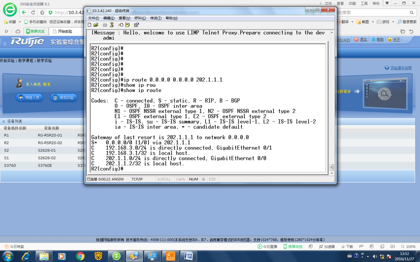
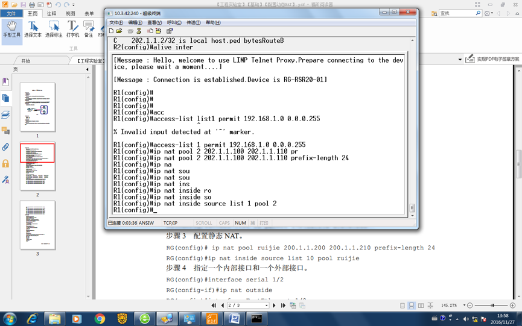
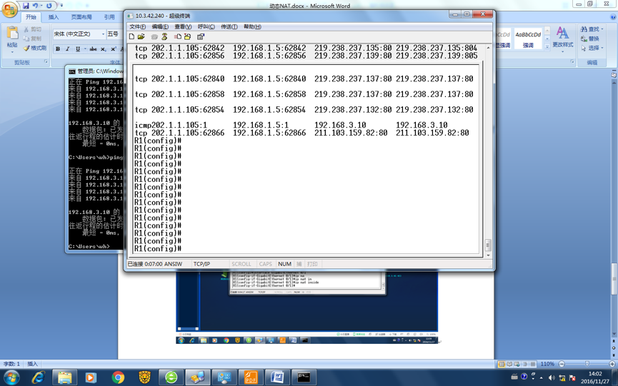

# 计算机网路课程设计实验报告

|-|-|
|:----:|:-----:|
|实验项目名称|动态NAT配置|
|实验小组成员|叶梅北宁 周贤杰 刘成科 刘力赋 沈飞|
|本次报告执笔人|叶梅北宁|

## 实验内容

配置路由器，将内部网络的私有IP地址使用合法的外部地址集转化为动态的外部IP从而完成访问外部网络的功能。

## 实验过程

### 实验器材

1. 2台或以上路由器
2. 2台或以上主机
3. 1台或以上交换机

### 实验准备

实验拓扑图:


实验中各个设备IP:

PC25: 192.168.3.10	

PC27: 192.168.1.10

PC26: 192.168.1.20

路由器R1的外部地址: 202.1.1.1

路由器R2的外部地址: 202.1.1.2

路由器R1的外部IP池: 202.1.1.100 - 202.1.1.110

### 实验目的

使路由器R1能在PC26或PC27访问外部地址时，动态分配IP池内的地址，完成NAT转换。

### 实验步骤

#### 1. 配置各端口IP地址，使网络能正常通信

* 配置R1，R2连接端口的IP地址
* 配置R1，R2内部的IP地址
* ***注意配置R1，R2的默认转发规则，将地址不明的数据包全部转发到对方IP***

```
R1: ip route 0.0.0.0 0.0.0.0 R2IP
R2: ip route 0.0.0.0 0.0.0.0 R1IP
```

完成后的路由表:

R1:


R2:




#### 2. 测试内网的通信状况

***需要保证3台机器使用内网IP时能够相互Ping通***

验证:


#### 3. 定义内部IP访问列表和NAT IP池


```
R1: access-list "list_name" permit "permit ip"
定义IP访问列表

R1: ip nat pool "pool_name" "pool ip container"
定义NAT IP池
```

验证:



### 实验验证

在路由器R1上完成动态NAT配置之后，R1内部网络中处于访问列表内的主机在访问外部网路时，R1会为其自动分配NAT IP池内的IP地址。

***验证方法***:

使用R1内部的主机Ping非R1内网的地址，在R1的Console中抓到NAT转发的ICMP包。



观察到R1的内部IP 193.168.1.5 被NAT转发为202.1.1.105


## 实验总结

* 实验需要注意的地方挺多，列出几个关键点。

> 在配置NAT转发之前，一定要保证先配置完成实验网络。

需要确保实验网络通畅，在设置NAT转发之前先确保实验机器可以相互连通。

> 两台路由器之间需要设置缺省路由转发

实验手册中的代码在我们的实验环境内无法生效，实验中使用的代码在实验步骤中。

