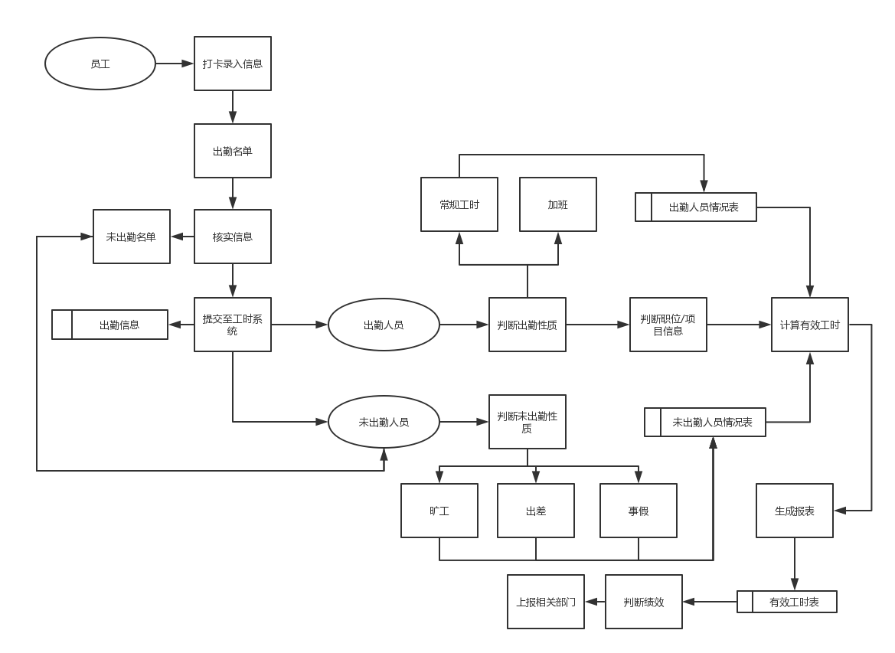
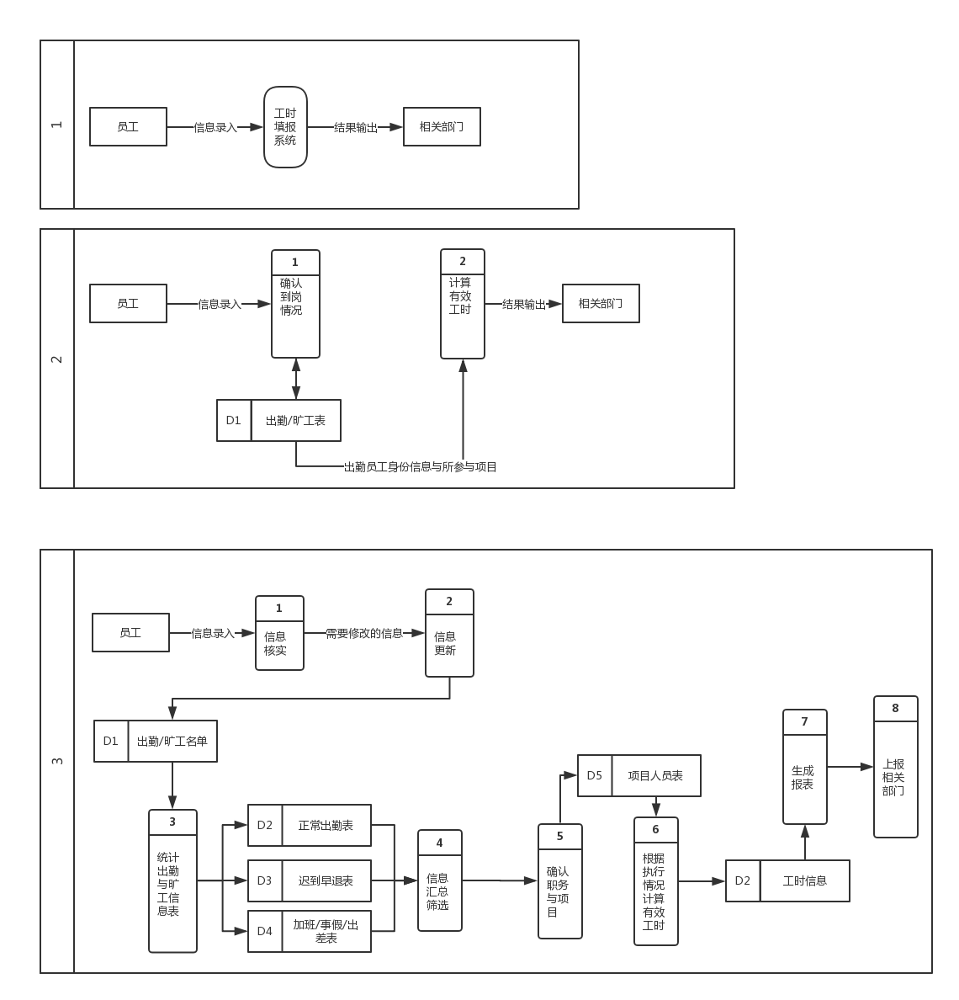
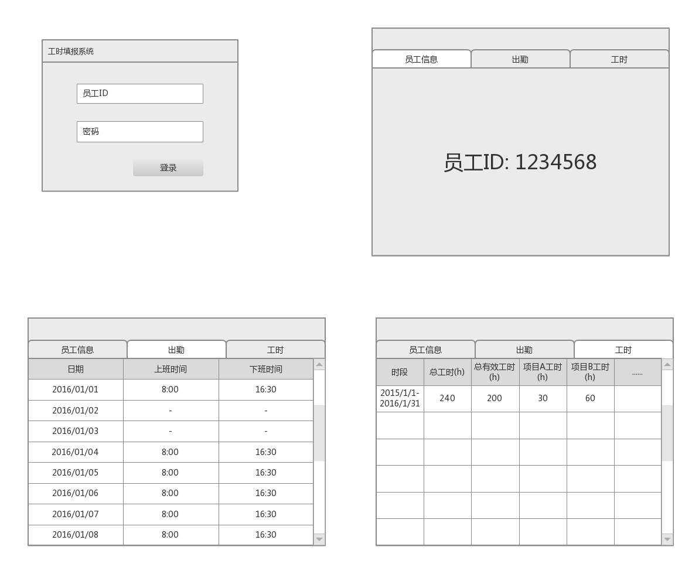
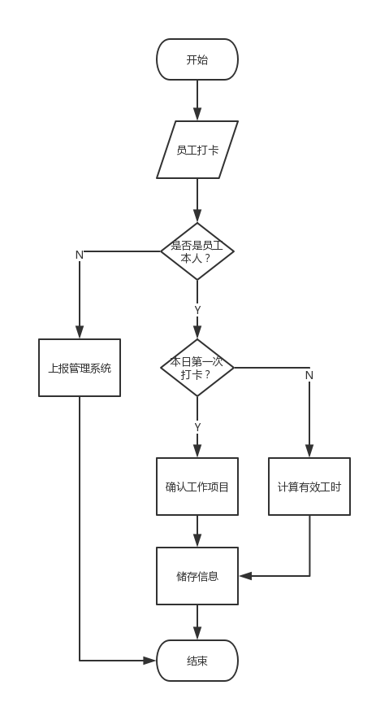
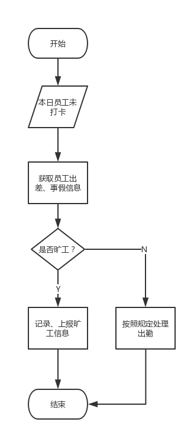

#软件工程课程设计：工时填报系统

|小组成员|陈品维14051409|刘成科14051422|刘力赋14051424|叶梅北宁14051435|周贤杰14051440|
|:---:|:---:|:---:|:---:|:---:|:---:|

# 需求分析

## 业务流程



##数据流图



## 数据分析

### 静态输入数据

员工(员工ID)  
项目(项目编号)

### 动态输入数据

员工(打卡时间，出勤日期，参与项目个数)  

### 内部生成数据

员工对应项目的工时

### 动态输出数据

每个员工的有效工时
每个项目参与员工信息

### 数据规定

### 数据采集

出勤员工通过打卡确认，然后根据数据库的信息对比判断其参与项目的具体情形

### 数据字典

```
名字：出勤&旷工表
别名：
描述：统计出勤在岗员工与未到人员的信息
位置：从打卡机输出到工时填报系统
```

```
定义：出勤员工ID+未出勤员工ID+上下班打卡时间
名字：工时报表
别名：  
描述：记录每个员工有效工时的报表  
定义：每个统计周期内，每个员工在某个项目中有效工作时间之和  
位置： 工时填报系统
```
  
```
名字：有效工时  
别名：  
描述：可以计入到绩效中的工时
定义： 每个项目的总工时-该项目的无效工时
位置：工时报表
```

##四、原型设计


# 系统设计

## 模块结构设计


## 数据设计

### 用户认证表

|uid(pk, fk)|user_name|password|
|:-:|:-:|:-:|

### 员工信息

|id(pk)|name|phone|level|uid|
|:-:|:-:|:-:|:-:|:-:|

### 项目信息

|pid(pk)|p_name|p_hours|
|:-:|:-:|:-:|

### 员工-项目

|id(pk)|p_id|u_id|
|:-:|:-:|:-:|

### 出勤

|id(pk)|date|uid|pid|start_time|end_time|
|:-:|:-:|:-:|:-:|:-:|:-:|

# 详细设计

## 出勤打卡系统逻辑





# 测试(等价分类法)

##用户
###用户ID
#####a).划分等价类:
|输入条件|有效等价类|无效等价类|
|:-:|:-:|:-:|
|整数|从0000000到9999999之间的7位数字①；|有非数字字符②；少于7位数字③；多于7位数字④；|
#####b).确定测试用例:
上表中有1个有效等价类，可以用下列测试用例:

|测试数据|测试范围|期望结果|
|:-:|:-:|:-:|
|0000001|等价类①；|有效|
对3个无效等价类，应选择3个测试用例，可以用下列测试用例:

|测试数据|测试范围|期望结果|
|:-:|:-:|:-:|
|000001|等价类③；|无效|
|00000001|等价类④；|无效|
|A000001|等价类②；|无效|

###用户密码
#####a).划分等价类:
|输入条件|有效等价类|无效等价类|
|:-:|:-:|:-:|
|字符|数字、字母、符号合起来10个以内；①|空格②；超出20个字符③；|
#####b).确定测试用例:
上表中有1个有效等价类，可以用下列测试用例:

|测试数据|测试范围|期望结果|
|:-:|:-:|:-:|
|123ABC!?ef|等价类①；|有效|
对2个无效等价类，应选择2个测试用例，可以用下列测试用例:

|测试数据|测试范围|期望结果|
|:-:|:-:|:-:|
|ABCDEFGHIJLKLMNOPQRSTUVWXYZ|等价类③；|无效|
|123 ABC!?ef|等价类②；|无效|

###用户姓名
#####a).划分等价类:
|输入条件|有效等价类|无效等价类|
|:-:|:-:|:-:|
|字符串|100以内的字母及“空格”或“-”；①|含数字②；含其他符号③；长度超过100④；|
#####b).确定测试用例:
上表中有1个有效等价类，可以用下列测试用例:

|测试数据|测试范围|期望结果|
|:-:|:-:|:-:|
|Tim Cook|等价类①；|有效|
对3个无效等价类，应选择3个测试用例，可以用下列测试用例:

|测试数据|测试范围|期望结果|
|:-:|:-:|:-:|
|Tim123|等价类②；|无效|
|Tim@4|等价类③；|无效|
|abcdef……hijklmn|等价类④；|无效|

##员工
###员工ID
#####a).划分等价类:
|输入条件|有效等价类|无效等价类|
|:-:|:-:|:-:|
|整数|从0000000到9999999之间的7位数字①；|有非数字字符②；少于7位数字③；多于7位数字④；|
#####b).确定测试用例:
上表中有1个有效等价类，可以用下列测试用例:

|测试数据|测试范围|期望结果|
|:-:|:-:|:-:|
|0000001|等价类①；|有效|
对3个无效等价类，应选择3个测试用例，可以用下列测试用例:

|测试数据|测试范围|期望结果|
|:-:|:-:|:-:|
|000001|等价类③；|无效|
|00000001|等价类④；|无效|
|A000001|等价类②；|无效|

###员工姓名
#####a).划分等价类:
|输入条件|有效等价类|无效等价类|
|:-:|:-:|:-:|
|字符串|100以内的字母及“空格”或“-”；①|含数字②；含其他符号③；长度超过100④；|
#####b).确定测试用例:
上表中有1个有效等价类，可以用下列测试用例:

|测试数据|测试范围|期望结果|
|:-:|:-:|:-:|
|Tim Cook|等价类①；|有效|
对3个无效等价类，应选择3个测试用例，可以用下列测试用例:

|测试数据|测试范围|期望结果|
|:-:|:-:|:-:|
|Tim123|等价类②；|无效|
|Tim@4|等价类③；|无效|
|abcdef……hijklmn|等价类④；|无效|

###员工联系方式
#####a).划分等价类:
|输入条件|有效等价类|无效等价类|
|:-:|:-:|:-:|
|前3位|150-159中除154的3位有效数字①；130-139的3位有效数字②；147③；180-189中除181、183、184的3位有效数字④；|在上述范围外的3位数字⑥；少于3位数字⑦；多于3位数字⑧；有非数字字符⑨；|
|后8位|00000000-99999999的8位数字⑤；|有非数字字符⑩；多于8位数字（11）；少于8位数字（12）；|
#####b).确定测试用例:
上表中有5个有效等价类，可以用下列测试用例:

|测试数据|测试范围|期望结果|
|:-:|:-:|:-:|
|15012345678|等价类①、⑤；|有效|
|13012345678|等价类②、⑤；|有效|
|14701234567|等价类③、⑤；|有效|
|18001234567|等价类④、⑤；|有效|
对7个无效等价类，应选择7个测试用例，可以用下列测试用例:

|测试数据|测试范围|期望结果|
|:-:|:-:|:-:|
|11100000000|等价类⑥、⑤；|无效|
|1201234567|等价类⑦、⑤；|无效|
|123401234567|等价类⑧、⑤；|无效|
|12*01234567|等价类⑨、⑤；|无效|
|1511234567*|等价类①、⑩；|无效|
|187123456789|等价类④、（11）；|无效|
|1871234567|等价类④、（12）；|无效|

###员工等级
#####a).划分等价类:
|输入条件|有效等价类|无效等价类|
|:-:|:-:|:-:|
|整数|1-5；①|非1-5的整数②；含非数字字符③；|
#####b).确定测试用例:
上表中有1个有效等价类，可以用下列测试用例:

|测试数据|测试范围|期望结果|
|:-:|:-:|:-:|
|1|等价类①；|有效|
对2个无效等价类，应选择2个测试用例，可以用下列测试用例:

|测试数据|测试范围|期望结果|
|:-:|:-:|:-:|
|6|等价类②；|无效|
|X1|等价类③；|无效|

###参与项目ID
#####a).划分等价类:
|输入条件|有效等价类|无效等价类|
|:-:|:-:|:-:|
|字符串|数字、大写字母合起来5个以内；①|空格②；超出5个字符③；含非数字或非大写字母④；|
#####b).确定测试用例:
上表中有1个有效等价类，可以用下列测试用例:

|测试数据|测试范围|期望结果|
|:-:|:-:|:-:|
|A0|等价类①；|有效|
对3个无效等价类，应选择3个测试用例，可以用下列测试用例:

|测试数据|测试范围|期望结果|
|:-:|:-:|:-:|
|A 0|等价类②；|无效|
|A00000|等价类③；|无效|
|a0000|等价类④；|无效|

###所属用户ID
#####a).划分等价类:
|输入条件|有效等价类|无效等价类|
|:-:|:-:|:-:|
|整数|从0000000到9999999之间的7位数字①；|有非数字字符②；少于7位数字③；多于7位数字④；|
#####b).确定测试用例:
上表中有1个有效等价类，可以用下列测试用例:

|测试数据|测试范围|期望结果|
|:-:|:-:|:-:|
|0000001|等价类①；|有效|
对3个无效等价类，应选择3个测试用例，可以用下列测试用例:

|测试数据|测试范围|期望结果|
|:-:|:-:|:-:|
|000001|等价类③；|无效|
|00000001|等价类④；|无效|
|A000001|等价类②；|无效|

##项目
###项目ID
#####a).划分等价类:
|输入条件|有效等价类|无效等价类|
|:-:|:-:|:-:|
|字符串|数字、大写字母合起来5个以内；①|空格②；超出5个字符③；非数字或非大写字母④；|
#####b).确定测试用例:
上表中有1个有效等价类，可以用下列测试用例:

|测试数据|测试范围|期望结果|
|:-:|:-:|:-:|
|A0|等价类①；|有效|
对3个无效等价类，应选择3个测试用例，可以用下列测试用例:

|测试数据|测试范围|期望结果|
|:-:|:-:|:-:|
|A00000|等价类③；|无效|
|A 0|等价类②；|无效|
|a0000|等价类④；|无效|

###项目名称
#####a).划分等价类:
|输入条件|有效等价类|无效等价类|
|:-:|:-:|:-:|
|字符串|1100以内的字母或数字及“空格”或“-”；①|含其他符号②；长度超过100③；|
#####b).确定测试用例:
上表中有1个有效等价类，可以用下列测试用例:

|测试数据|测试范围|期望结果|
|:-:|:-:|:-:|
|Big Data 2|等价类①；|有效|
对2个无效等价类，应选择2个测试用例，可以用下列测试用例:

|测试数据|测试范围|期望结果|
|:-:|:-:|:-:|
|Big Data 2!|等价类②；|无效|
|Big Data Big Data Big Data ……Big Data|等价类③；|无效|

###开始时间
#####a).划分等价类:
|输入条件|有效等价类|无效等价类|
|:-:|:-:|:-:|
|年|2016或2017①；|除2016和2017外的任何字符④；|
|月|01-12②；|少于2位数字⑤；大于12的数字⑥；非数字字符⑦；|
|日|01-31③；|少于2位数字⑧；不符合月份内的数字⑨；非数字字符⑩；|
#####b).确定测试用例:
上表中有3个有效等价类，可以用下列测试用例:

|测试数据|测试范围|期望结果|
|:-:|:-:|:-:|
|2016-01-10|等价类①、②、③；|有效|
对7个无效等价类，应选择7个测试用例，可以用下列测试用例:

|测试数据|测试范围|期望结果|
|:-:|:-:|:-:|
|2016-0-10|等价类①、⑤、③;|无效|
|2016-13-10|等价类①、⑥、③;|无效|
|2016-**-10|等价类①、⑦、③;|无效|
|2016-01-0|等价类①、②、⑧;|无效|
|2016-02-30|等价类①、②、⑨	;|无效|
|2016-02-**|等价类①、②、⑩	;|无效|
|2000-01-01|等价类④、②、③;|无效|

###截止时间
#####a).划分等价类:
|输入条件|有效等价类|无效等价类|
|:-:|:-:|:-:|
|年|2016或2017①；|除2016和2017外的任何字符④；|
|月|01-12②；|少于2位数字⑤；大于12的数字⑥；非数字字符⑦；|
|日|01-31③；|少于2位数字⑧；不符合月份内的数字⑨；非数字字符⑩；|
#####b).确定测试用例:
上表中有3个有效等价类，可以用下列测试用例:

|测试数据|测试范围|期望结果|
|:-:|:-:|:-:|
|2016-01-10|等价类①、②、③；|有效|
对7个无效等价类，应选择7个测试用例，可以用下列测试用例:

|测试数据|测试范围|期望结果|
|:-:|:-:|:-:|
|2016-0-10|等价类①、⑤、③;|无效|
|2016-13-10|等价类①、⑥、③;|无效|
|2016-**-10|等价类①、⑦、③;|无效|
|2016-01-0|等价类①、②、⑧;|无效|
|2016-02-30|等价类①、②、⑨	;|无效|
|2016-02-**|等价类①、②、⑩	;|无效|
|2000-01-01|等价类④、②、③;|无效|

##打卡系统
###员工ID
#####a).划分等价类:
|输入条件|有效等价类|无效等价类|
|:-:|:-:|:-:|
|整数|从0000000到9999999之间的7位数字①；|有非数字字符②；少于7位数字③；多于7位数字④；|
#####b).确定测试用例:
上表中有1个有效等价类，可以用下列测试用例:

|测试数据|测试范围|期望结果|
|:-:|:-:|:-:|
|0000001|等价类①；|有效|
对3个无效等价类，应选择3个测试用例，可以用下列测试用例:

|测试数据|测试范围|期望结果|
|:-:|:-:|:-:|
|000001|等价类③；|无效|
|00000001|等价类④；|无效|
|A000001|等价类②；|无效|

###参与项目ID
#####a).划分等价类:
|输入条件|有效等价类|无效等价类|
|:-:|:-:|:-:|
|整数|从0000000到9999999之间的7位数字①；|有非数字字符②；少于7位数字③；多于7位数字④；|
#####b).确定测试用例:
上表中有1个有效等价类，可以用下列测试用例:

|测试数据|测试范围|期望结果|
|:-:|:-:|:-:|
|0000001|等价类①；|有效|
对3个无效等价类，应选择3个测试用例，可以用下列测试用例:

|测试数据|测试范围|期望结果|
|:-:|:-:|:-:|
|000001|等价类③；|无效|
|00000001|等价类④；|无效|
|A000001|等价类②；|无效|

###日期
#####a).划分等价类:
|输入条件|有效等价类|无效等价类|
|:-:|:-:|:-:|
|年|2016或2017①；|除2016和2017外的任何字符④；|
|月|01-12②；|少于2位数字⑤；大于12的数字⑥；非数字字符⑦；|
|日|01-31③；|少于2位数字⑧；不符合月份内的数字⑨；非数字字符⑩；|
#####b).确定测试用例:
上表中有3个有效等价类，可以用下列测试用例:

|测试数据|测试范围|期望结果|
|:-:|:-:|:-:|
|2016-01-10|等价类①、②、③；|有效|
对7个无效等价类，应选择7个测试用例，可以用下列测试用例:

|测试数据|测试范围|期望结果|
|:-:|:-:|:-:|
|2016-0-10|等价类①、⑤、③;|无效|
|2016-13-10|等价类①、⑥、③;|无效|
|2016-**-10|等价类①、⑦、③;|无效|
|2016-01-0|等价类①、②、⑧;|无效|
|2016-02-30|等价类①、②、⑨	;|无效|
|2016-02-**|等价类①、②、⑩	;|无效|
|2000-01-01|等价类④、②、③;|无效|

###出勤打卡
#####a).划分等价类:
|输入条件|有效等价类|无效等价类|
|:-:|:-:|:-:|
|时|0-24①；|大于24的数字③；非数字字符④；|
|分|0-60②；|大于60的数字⑤；非数字字符⑥；|
#####b).确定测试用例:
上表中有2个有效等价类，可以用下列测试用例:

|测试数据|测试范围|期望结果|
|:-:|:-:|:-:|
|08:30|等价类①、②；|有效|
对4个无效等价类，应选择4个测试用例，可以用下列测试用例:

|测试数据|测试范围|期望结果|
|:-:|:-:|:-:|
|8:61|等价类①、⑤；|无效|
|8:**|等价类①、⑥；|无效|
|25:30|等价类②、③；|无效|
|**:30|等价类②、④；|无效|

###下班打卡
#####a).划分等价类:
|输入条件|有效等价类|无效等价类|
|:-:|:-:|:-:|
|时|0-24①；|大于24的数字③；非数字字符④；|
|分|0-60②；|大于60的数字⑤；非数字字符⑥；|
#####b).确定测试用例:
上表中有2个有效等价类，可以用下列测试用例:

|测试数据|测试范围|期望结果|
|:-:|:-:|:-:|
|08:30|等价类①、②；|有效|
对4个无效等价类，应选择4个测试用例，可以用下列测试用例:

|测试数据|测试范围|期望结果|
|:-:|:-:|:-:|
|8:61|等价类①、⑤；|无效|
|8:**|等价类①、⑥；|无效|
|25:30|等价类②、③；|无效|
|**:30|等价类②、④；|无效|

###有效工时
#####a).划分等价类:
|输入条件|有效等价类|无效等价类|
|:-:|:-:|:-:|
|整数|整数①；|有非数字字符②；|
#####b).确定测试用例:
上表中有1个有效等价类，可以用下列测试用例:

|测试数据|测试范围|期望结果|
|:-:|:-:|:-:|
|200|等价类①；|有效|
对1个无效等价类，应选择1个测试用例，可以用下列测试用例:

|测试数据|测试范围|期望结果|
|:-:|:-:|:-:|
|100A|等价类②；|无效|

###员工状态
#####a).划分等价类:
|输入条件|有效等价类|无效等价类|
|:-:|:-:|:-:|
|字符串|正常 ①；旷工②；出差③；事假④；|其他⑤；|
#####b).确定测试用例:
上表中有4个有效等价类，可以用下列测试用例:

|测试数据|测试范围|期望结果|
|:-:|:-:|:-:|
|正常|等价类①；|有效|
|旷工|等价类②	;|有效|
|出差|等价类③；|有效|
|事假|等价类④;|有效|
对1个无效等价类，应选择1个测试用例，可以用下列测试用例:

|测试数据|测试范围|期望结果|
|:-:|:-:|:-:|
|未知|等价类⑤；|无效|

##计算系统
###员工ID
#####a).划分等价类:
|输入条件|有效等价类|无效等价类|
|:-:|:-:|:-:|
|整数|从0000000到9999999之间的7位数字①；|有非数字字符②；少于7位数字③；多于7位数字④；|
#####b).确定测试用例:
上表中有1个有效等价类，可以用下列测试用例:

|测试数据|测试范围|期望结果|
|:-:|:-:|:-:|
|0000001|等价类①；|有效|
对3个无效等价类，应选择3个测试用例，可以用下列测试用例:

|测试数据|测试范围|期望结果|
|:-:|:-:|:-:|
|000001|等价类③；|无效|
|00000001|等价类④；|无效|
|A000001|等价类②；|无效|

###员工薪资
#####a).划分等价类:
|输入条件|有效等价类|无效等价类|
|:-:|:-:|:-:|
|整数|整数①；|有非数字字符②；|
#####b).确定测试用例:
上表中有1个有效等价类，可以用下列测试用例:

|测试数据|测试范围|期望结果|
|:-:|:-:|:-:|
|10000|等价类①；|有效|
对1个无效等价类，应选择1个测试用例，可以用下列测试用例:

|测试数据|测试范围|期望结果|
|:-:|:-:|:-:|
|X10000|等价类③；|无效|

###项目ID
#####a).划分等价类:
|输入条件|有效等价类|无效等价类|
|:-:|:-:|:-:|
|整数|从0000000到9999999之间的7位数字①；|有非数字字符②；少于7位数字③；多于7位数字④；|
#####b).确定测试用例:
上表中有1个有效等价类，可以用下列测试用例:

|测试数据|测试范围|期望结果|
|:-:|:-:|:-:|
|0000001|等价类①；|有效|
对3个无效等价类，应选择3个测试用例，可以用下列测试用例:

|测试数据|测试范围|期望结果|
|:-:|:-:|:-:|
|000001|等价类③；|无效|
|00000001|等价类④；|无效|
|A000001|等价类②；|无效|

###项目支出
#####a).划分等价类:
|输入条件|有效等价类|无效等价类|
|:-:|:-:|:-:|
|整数|整数①；|有非数字字符②；|
#####b).确定测试用例:
上表中有1个有效等价类，可以用下列测试用例:

|测试数据|测试范围|期望结果|
|:-:|:-:|:-:|
|10000|等价类①；|有效|
对1个无效等价类，应选择3个测试用例，可以用下列测试用例:

|测试数据|测试范围|期望结果|
|:-:|:-:|:-:|
|X10000|等价类②；|无效|

##统计报表
###员工ID
#####a).划分等价类:
|输入条件|有效等价类|无效等价类|
|:-:|:-:|:-:|
|整数|从0000000到9999999之间的7位数字①；|有非数字字符②；少于7位数字③；多于7位数字④；|
#####b).确定测试用例:
上表中有1个有效等价类，可以用下列测试用例:

|测试数据|测试范围|期望结果|
|:-:|:-:|:-:|
|0000001|等价类①；|有效|
对3个无效等价类，应选择3个测试用例，可以用下列测试用例:

|测试数据|测试范围|期望结果|
|:-:|:-:|:-:|
|000001|等价类③；|无效|
|00000001|等价类④；|无效|
|A000001|等价类②；|无效|

###出勤情况
#####a).划分等价类:
|输入条件|有效等价类|无效等价类|
|:-:|:-:|:-:|
|年|2016或2017①；|除2016和2017外的任何字符④；|
|月|01-12②；|少于2位数字⑤；大于12的数字⑥；非数字字符⑦；|
|日|01-31③；|少于2位数字⑧；不符合月份内的数字⑨；非数字字符⑩；|
|字符串|正常或旷或出差或事假之一（11）；|其他（12）；|
#####b).确定测试用例:
上表中有4个有效等价类，可以用下列测试用例:

|测试数据|测试范围|期望结果|
|:-:|:-:|:-:|
|2016-01-10正常|等价类①、②、③、（11）；|有效|
对8个无效等价类，应选择8个测试用例，可以用下列测试用例:

|测试数据|测试范围|期望结果|
|:-:|:-:|:-:|
|2016-0-10 正常|等价类①、⑤、③、（11）；|无效|
|2016-13-10 矿工|等价类①、⑥、③、（11）；|无效|
|2016-**-10 事假|等价类①、⑦、③、（11）；|无效|
|2016-01-0 出差|等价类①、②、⑧、（11）；|无效|
|2016-02-30 正常|等价类①、②、⑨、（11）；|无效|
|2016-02-** 矿工|等价类①、②、⑩、（11）；|无效|
|2000-01-01 事假|等价类④、②、③、（11）；|无效|
|2016-01-10 其他|等价类①、②、③、（12）；|无效|

###总有效工时
#####a).划分等价类:
|输入条件|有效等价类|无效等价类|
|:-:|:-:|:-:|
|整数|整数①；|有非数字字符②；|
#####b).确定测试用例:
上表中有1个有效等价类，可以用下列测试用例:

|测试数据|测试范围|期望结果|
|:-:|:-:|:-:|
|200|等价类①；|有效|
对1个无效等价类，应选择3个测试用例，可以用下列测试用例:

|测试数据|测试范围|期望结果|
|:-:|:-:|:-:|
|100A|等价类②；|无效|


